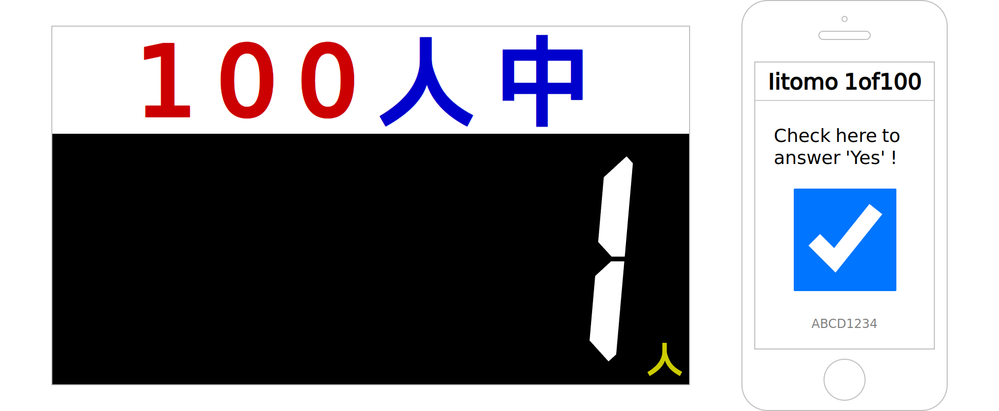

# iitomo-1of100

[](https://github.com/aKuad/iitomo-1of100/releases)

Waratte iitomo! (A Japanese TV program) 1 of 100 survey system

[It's available on online!](https://iitomo-1of100.deno.dev/)

Usage guide is [also available on online.](https://akuad.github.io/iitomo-1of100)



## What is 1of100?

Waratte iitomo! (everyone called it 'iitomo') is a Japanese TV program. 1of100 people is a game in the TV program.

100 audiences are in the studio. Then guest personality ask a true/false question to audiences.

If only 1 audience answered true, it success.

## Deployment

If you wish to deploy to own server:

Clone this repository, then just only run `src/main.ts` by [Deno](https://deno.com/):

```sh
git clone --depth=1 https://github.com/aKuad/iitomo-1of100.git
cd iitomo-1of100

cd src
deno run --allow-net --allow-read main.ts
```

## Using libraries/fonts

[QRCode.js](https://davidshimjs.github.io/qrcodejs/) - (c) 2012 [davidshimjs](https://github.com/davidshimjs)

[DSEG](https://www.keshikan.net/fonts-e.html) - (c) 2017 [keshikan](http://www.keshikan.net)

## License

Iitomo 1of100 - [CC0](./LICENSE.md#iitomo-1of100)

QRCode.js - [MIT License](./LICENSE.md#qrcodejs)

DSEG - [SIL OPEN FONT LICENSE](./LICENSE.md#dseg)
