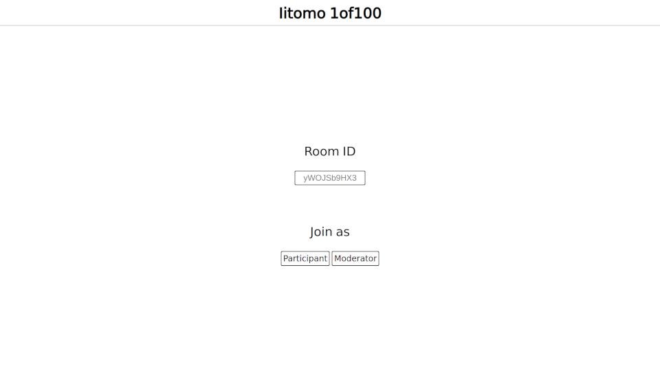
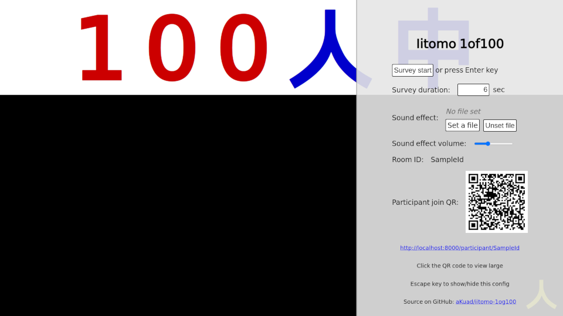
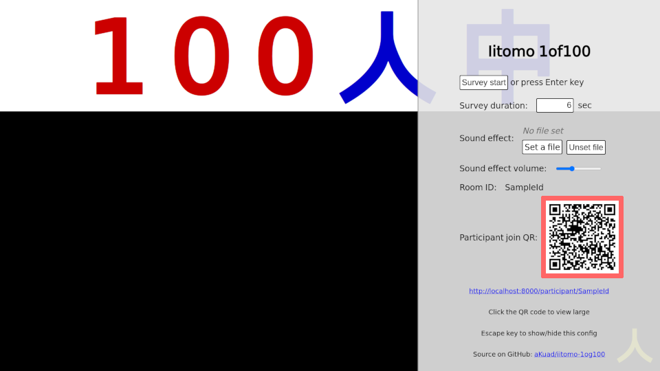
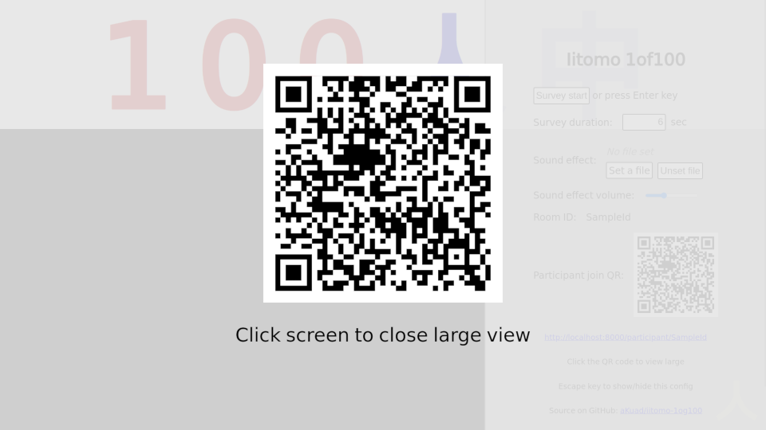
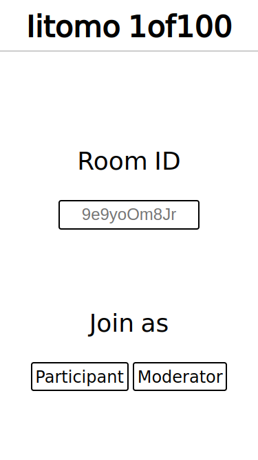
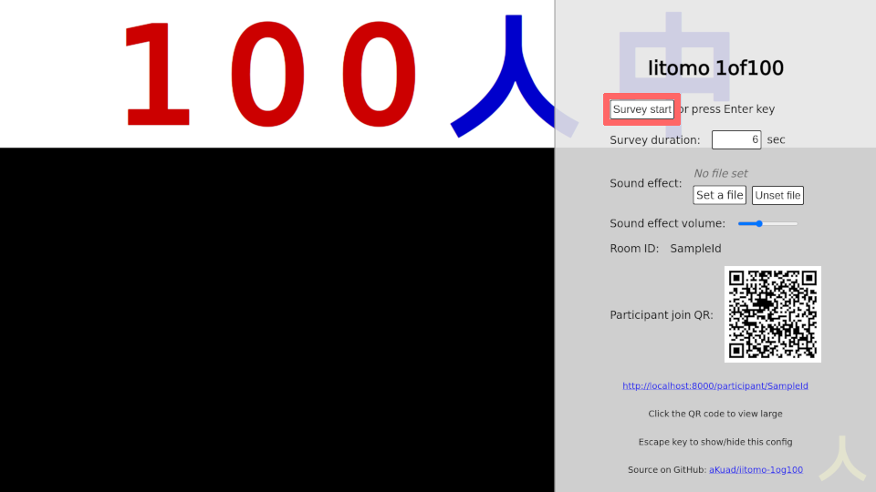
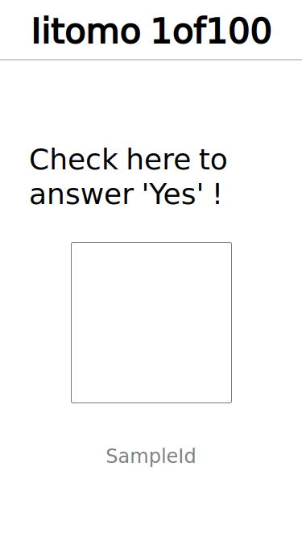

# iitomo-1of100

[](https://github.com/aKuad/iitomo-1of100/releases)

Waratte iitomo! (A Japanese TV program) 1 of 100 survey system


## What is 1of100?

Waratte iitomo! (everyone called it 'iitomo') is a Japanese TV program. 1of100 people is a game in the TV program.

100 audiences are in the studio. Then guest personality ask a true/false question to audiences.

If only 1 audience answered true, it success.

## Usage

### 1. Moderator join

Access to `/` (index). For Deno Deploy, <https://iitomo-1of100.deno.dev/>.



Input custom ID. Or empty, random generated ID will be applied.

Then press `Moderator` button.

### 2. Survey configuration

`Esc` key to show/hide config panel.



### 3. Participant join

#### By QR (recommended)

Participant join QR is shown on moderator config panel.



By clicking the QR, large view shown.



Just only scan it.

#### By ID

Access to `/` (index).



Input ID (shown on moderator config panel), then press `Participant` button.

### 4. Survey start

`Enter` key to start survey, or press the button.




During survey, checkbox be enable.



Finally, count of True of participants will be shown on moderator screen.


## Deployment

It's available on Deno Deploy: <https://iitomo-1of100.deno.dev/>

If you wish to deploy to own server, follow the step.

> [!NOTE]
>
> As requirements, install [Deno](https://deno.com/) at first.

Just only run `src/main.ts` by Deno:

```sh
cd src
deno run --allow-net --allow-read main.ts
```

## Using libraries/fonts

[qrcode.js](https://davidshimjs.github.io/qrcodejs/) - (c) 2012 davidshimjs

[DSEG](https://www.keshikan.net/fonts-e.html) - (c) 2017, keshikan (<http://www.keshikan.net>)

## License

QRCode.js - MIT License

DSEG - SIL OPEN FONT LICENSE

Other of them - CC0
