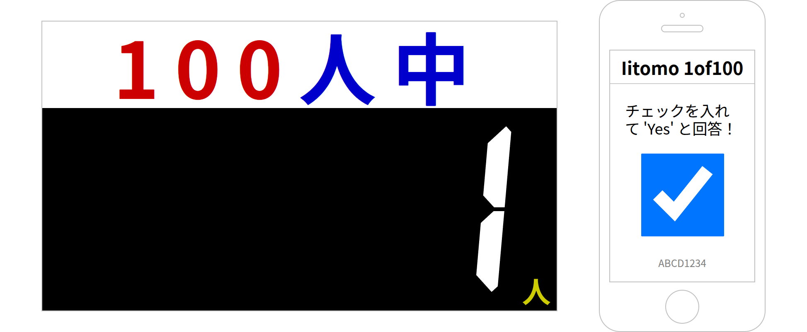

# iitomo-1of100

[](https://github.com/aKuad/iitomo-1of100/releases)

笑っていいとも!100人中1人アンケートシステム

[オンラインで利用可能です！](https://iitomo-1of100.deno.dev/)

使い方も[オンラインで確認できます。](https://akuad.github.io/iitomo-1of100/ja.html)



## 100人中1人とは？

平日昼に放送されていた長寿バラエティ番組「笑っていいとも！」100人中1人はその番組内で行われていたゲームの一つです。

スタジオに 100人の観覧がいて、その日のゲストが観覧に、はい/いいえで答えられる質問を出します。

観覧の 1人だけが「はい」と答えたら成功です。

## デプロイ

独自のサーバへのデプロイをするなら:

本リポジトリをクローン、そして [Deno](https://deno.com/) で `src/main.ts` を起動します。

```sh
git clone --depth=1 https://github.com/aKuad/iitomo-1of100.git
cd iitomo-1of100

cd src
deno run --allow-net --allow-read main.ts
```

## 使用ライブラリ/フォント

[qrcode.js](https://davidshimjs.github.io/qrcodejs/) - (c) 2012 davidshimjs

[DSEG](https://www.keshikan.net/fonts-e.html) - (c) 2017, keshikan (<http://www.keshikan.net>)

## ライセンス

QRCode.js - MIT License

DSEG - SIL OPEN FONT LICENSE

Other of them - CC0
