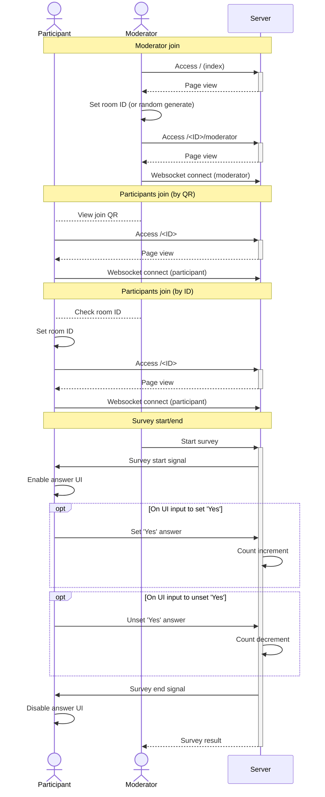

# Sequence diagram

```mermaid
sequenceDiagram
  actor P as Participant
  actor M as Moderator
  participant S as Server

  Note over P,S: Moderator join
  M->>+S: Access / (index)
  S-->>-M: Page view

  M->>M: Set room ID (or random generate)
  M->>+S: Access /<ID>/moderator
  S-->>-M: Page view
  M->>S: Websocket connect (moderator)

  Note over P,S: Participants join (by QR)
  M-->P: View join QR
  P->>+S: Access /<ID>
  S-->>-P: Page view
  P->>S: Websocket connect (participant)

  Note over P,S: Participants join (by ID)
  M-->P: Check room ID
  P->>P: Set room ID
  P->>+S: Access /<ID>
  S-->>-P: Page view
  P->>S: Websocket connect (participant)

  Note over P,S: Survey start/end
  M->>+S: Start survey
  S->>P: Survey start signal
  P->>P: Enable answer UI
  opt On UI input to set 'Yes'
    P->>S: Set 'Yes' answer
    S->>S: Count increment
  end
  opt On UI input to unset 'Yes'
    P->>S: Unset 'Yes' answer
    S->>S: Count decrement
  end
  S->>P: Survey end signal
  P->>P: Disable answer UI
  S-->>-M: Survey result
```
