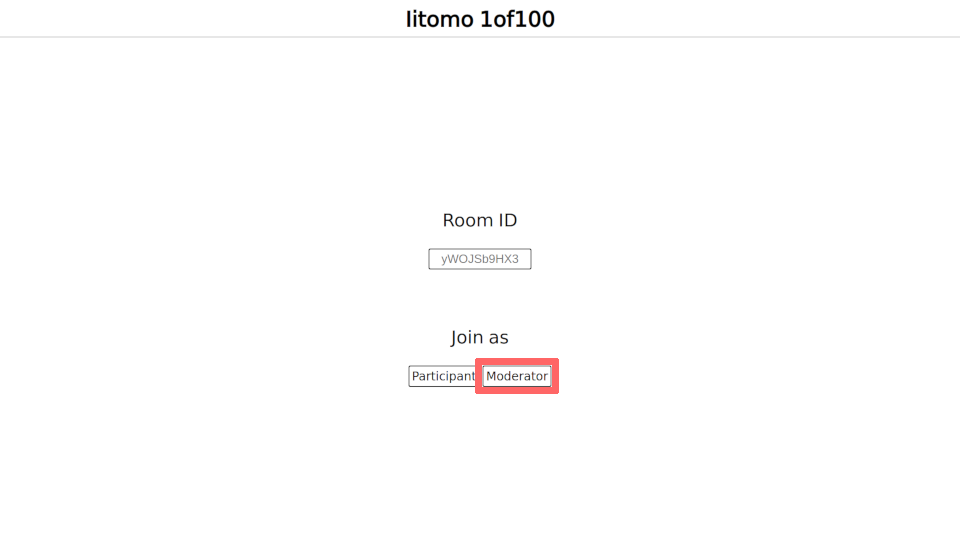
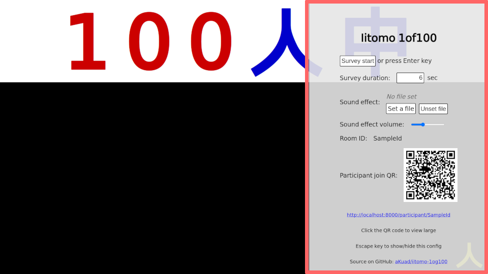
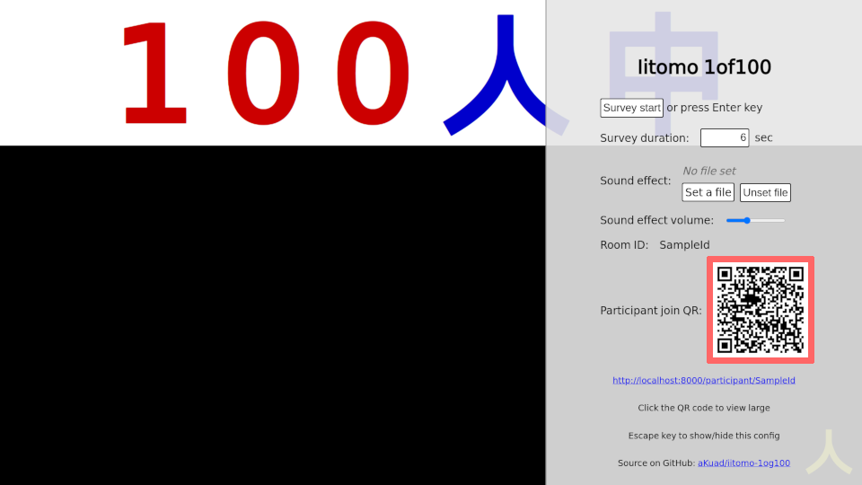
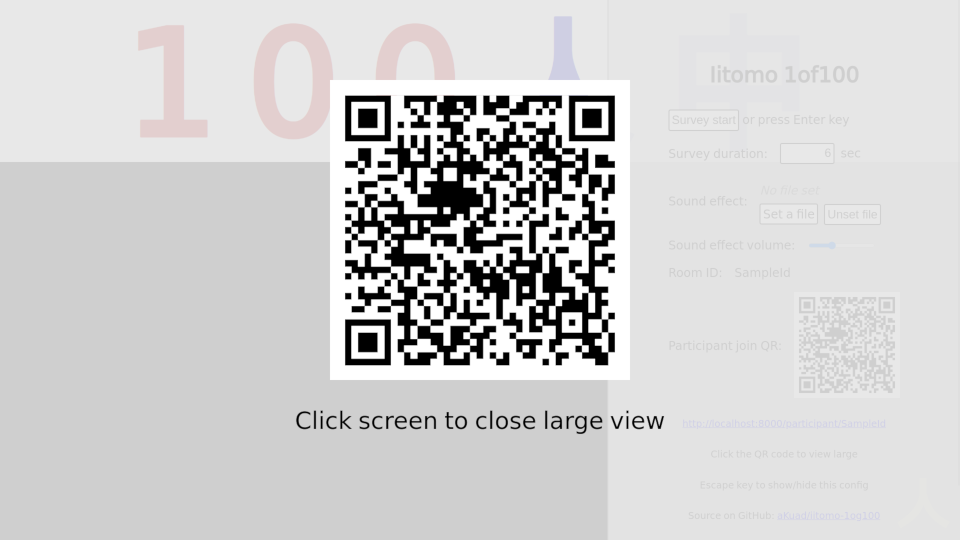
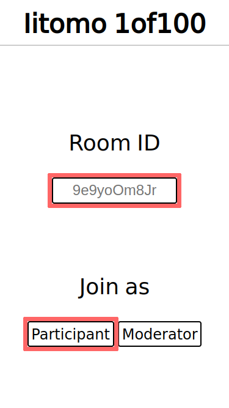
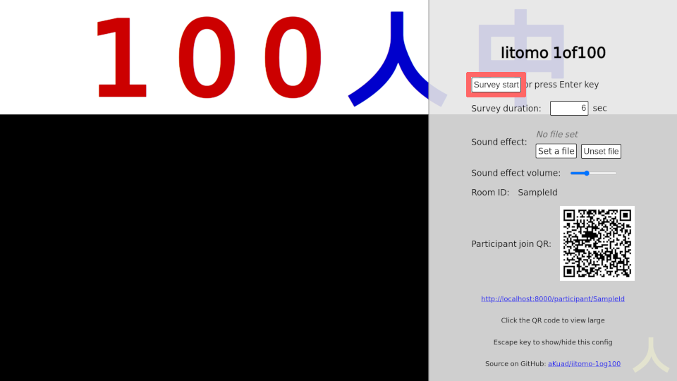
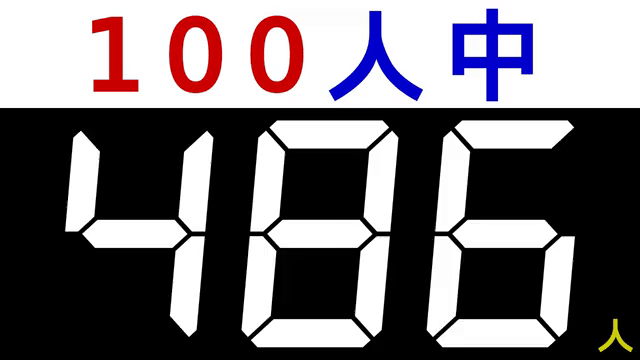
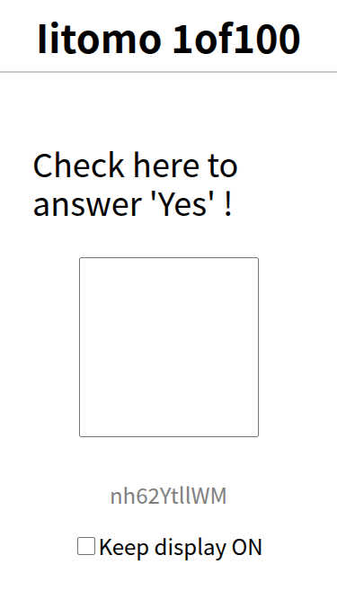
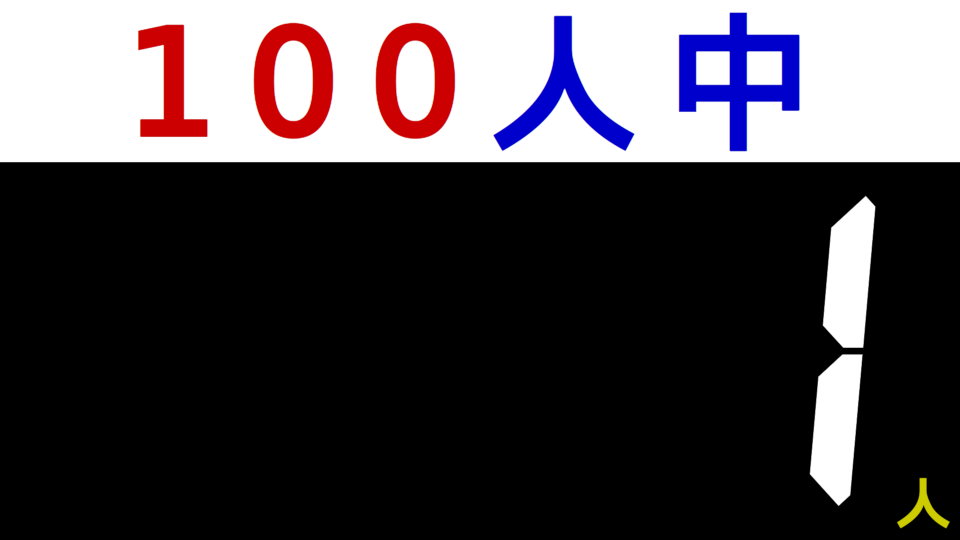

# Usage

## 1. Moderator setup

### 1.1. Moderator join

Access to: <https://iitomo-1of100.deno.dev/>

For self hosted: `http(s)://<server-address>/` - Source on GitHub: [aKuad/iitomo-1of100](https://github.com/aKuad/iitomo-1of100)

Input custom ID. Or empty, random generated ID will be applied.

Then press `Moderator` button.

### 1.2. Survey configuration

`Esc` key to show/hide config panel.

## 2. Participant join

### a. By QR (recommended)

Participant join QR is shown on moderator config panel.

Just only scan it.

By clicking the QR, large view shown.

### b. By ID

Access to: <https://iitomo-1of100.deno.dev/>

For self hosted: `http(s)://<server-address>/`

Input ID (shown on moderator config panel), then press `Participant` button.

## 3. Survey run

### 3.1. Start (moderator)

`Enter` key to start survey, or press the button.

### 3.2. Response (participant)

During survey, checkbox be enable.

### 3.3. Result (moderator)

Finally, count of True of participants will be shown on moderator screen.

