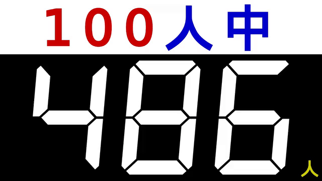

# 使い方

## 1. 司会者セットアップ

### 1.1. 司会者 参加

トップページアクセスします: <https://iitomo-1of100.deno.dev/>

セルフホストの場合: `http(s)://<server-address>/`

任意のルーム ID を入力します。または空欄の場合、ランダムに生成された ID を適用します。

そして `司会者` ボタンを押下します。

### 1.2. アンケート設定

`Esc` キー、または画面右上のボタンでコンフィグパネルの表示/非表示を切り替えできます。

## 2. 回答者 参加

### a. QR コードで参加 (推奨)

回答者参加 QR コードは、司会者コンフィグパネルに表示されています。

これをスキャンします。

QR コードを押下すると、大きいサイズで表示されます。

### b. ID 入力で参加

トップページにアクセスします: <https://iitomo-1of100.deno.dev/>

セルフホストの場合: `http(s)://<server-address>/`

ルーム ID (コンフィグパネルに表示されているもの) を入力し、`回答者` ボタンを押下します。

## 3. アンケート開始

### 3.1. スタート (司会者)

`Enter` キー、またはコンフィグパネルのボタンでアンケートを開始します。

### 3.2. 回答 (回答者)

アンケート中、チェックボックスが有効になります。

### 3.3. 結果 (司会者)

アンケート終了後、'はい' と答えた人数が司会者画面に表示されます。

